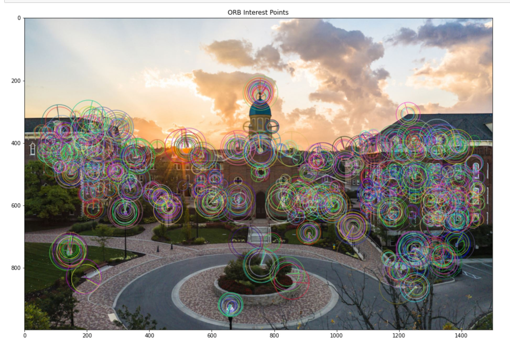
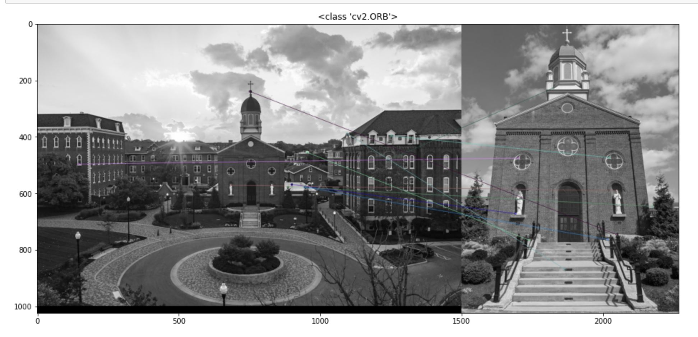

# Features-Extraction-and-Matching
"feature-extraction" file --> Detecting the features of an image and displaying the keypoints on the image using SIFT Detector.  

  

"feature-matching" file --> Detecting the features on 2 images and matching the keypoints on both images using Brute-Force Matcher with ORB descriptors.  

